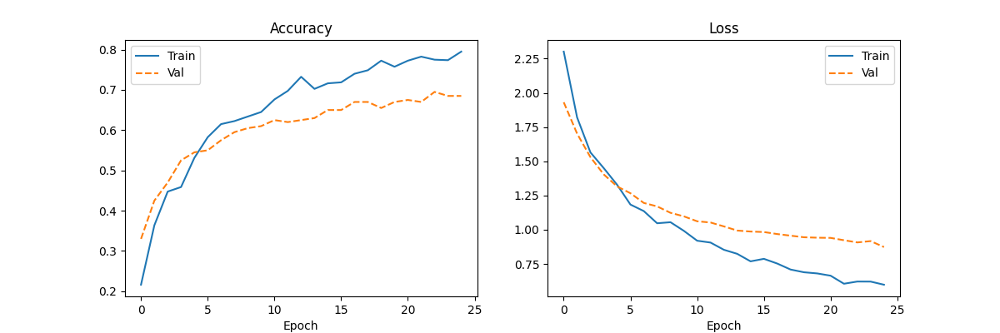

# 🎵 Music Genre Classification using MLP

A machine learning project that classifies audio clips into one of **10 music genres** using a Multi-Layer Perceptron (MLP) neural network trained on hand-crafted audio features extracted from the GTZAN dataset.

---

## 📌 Project Overview

This system takes a 30-second `.wav` audio file as input, extracts 57 acoustic features (MFCCs, chroma, spectral features, tempo, etc.), and predicts the genre with a confidence score. It was built using TensorFlow/Keras and Scikit-learn, trained on 1000 songs across 10 genres.

**Achieved Validation Accuracy: ~70%**

---

## 🗂️ Project Structure
```
music-genre-classification/
│
├── Data/
│   ├── genres_original       
│   └── features_30_sec.csv        # GTZAN feature dataset
├── saved_model/
│   ├── genre_model.keras          # Trained MLP model
│   └── scaler.pkl                 # Fitted StandardScaler (must match training)
│
├── config.py                      # Central configuration (paths, genres, epochs)
├── step1_train.py                 # Data loading, model building, and training
├── step2_test.py                  # Feature extraction and genre prediction
└── training_curves.png            # Accuracy & loss plots from training 
```

---

## 🎼 Supported Genres

| # | Genre     | # | Genre    |
|---|-----------|---|----------|
| 1 | Blues     | 6 | Jazz     |
| 2 | Classical | 7 | Metal    |
| 3 | Country   | 8 | Pop      |
| 4 | Disco     | 9 | Reggae   |
| 5 | Hip-Hop   | 10 | Rock     |


---

## 🧠 Model Architecture
```
Input Layer       →  57 features (acoustic descriptors)
Dense Layer 1     →  128 neurons, ReLU activation
Dropout           →  30% drop rate
Dense Layer 2     →  64 neurons, ReLU activation
Dropout           →  30% drop rate
Output Layer      →  10 neurons, Softmax activation
```

| Component      | Choice                          | Reason                                               |
|----------------|---------------------------------|------------------------------------------------------|
| Optimizer      | Adam                            | Adaptive learning rate; fast convergence             |
| Loss Function  | Categorical Cross-Entropy       | Standard for multi-class classification              |
| Activation     | ReLU (hidden), Softmax (output) | ReLU avoids vanishing gradients; Softmax gives probabilities |
| Regularization | Dropout (0.3)                   | Reduces overfitting by randomly silencing neurons    |
| Epochs         | 25                              | Balanced learning without significant overfitting    |
| Train/Val Split| 80 / 20                         | 800 songs for training, 200 for validation           |

---

## 📊 Features Extracted (57 total)

Each song is described by the following features, computed as **mean + variance** over the 30-second clip:

| Feature               | Description                                         | # Values |
|-----------------------|-----------------------------------------------------|----------|
| Length                | Total number of audio samples                       | 1        |
| Chroma STFT           | Distribution across 12 musical pitch classes        | 2        |
| RMS Energy            | Signal loudness / energy                            | 2        |
| Spectral Centroid     | "Brightness" — center of mass of frequency content  | 2        |
| Spectral Bandwidth    | Width of the dominant frequency range               | 2        |
| Spectral Rolloff      | Frequency below which 85% of energy lies            | 2        |
| Zero Crossing Rate    | Rate of sign changes — measures noisiness           | 2        |
| Harmonic Components   | Melodic/tonal content (HPSS)                        | 2        |
| Percussive Components | Rhythmic/beat content (HPSS)                        | 2        |
| Tempo                 | Beats per minute                                    | 1        |
| MFCC 1–20             | Mel-Frequency Cepstral Coefficients (timbre model)  | 40       |
| **Total**             |                                                     | **57**   |

---

## 📈 Training Results



- **Training Accuracy** reaches ~80% by epoch 25
- **Validation Accuracy** plateaus at ~70%
- Both loss curves decline steadily with no severe divergence — indicating the model is learning without extreme overfitting
- The modest gap between train and val curves suggests Dropout is working effectively at 25 epochs

---

## ⚙️ Setup & Installation

### Prerequisites

- Python 3.8+
- pip

### Install Dependencies
```bash
pip install tensorflow scikit-learn pandas numpy matplotlib librosa
```

---

## 🚀 Usage

### Step 1 — Configure Paths

Edit `config.py` to set your file paths, genre list, and number of training epochs:
```python
CSV_PATH        = "Data/features_30_sec.csv"
MODEL_SAVE_PATH = "saved_model/genre_model.keras"
SCALER_PATH     = "saved_model/scaler.pkl"
EPOCHS          = 25
```

### Step 2 — Train the Model
```bash
python step1_train.py
```

This will:
- Load and normalize features from the CSV
- Build and train the MLP
- Save the model to `saved_model/genre_model.keras`
- Save the scaler to `saved_model/scaler.pkl`
- Generate and save `training_curves.png`

### Step 3 — Predict a Song's Genre
```bash
python step2_test.py
```

Then enter the path to any `.wav` file when prompted:
```
Enter wav file path (or 'exit'): /path/to/your/song.wav

  GENRE      : JAZZ
  CONFIDENCE : 84.3%
```

Type `exit` to quit.

---

## 📂 Dataset

This project uses the **GTZAN Genre Collection** dataset:

- **1000 audio clips** — 100 per genre × 10 genres
- Each clip is **30 seconds** long
- Features were pre-extracted into `features_30_sec.csv` (1000 rows × 58 columns)
- Original dataset: [GTZAN](https://www.kaggle.com/datasets/andradaolteanu/gtzan-dataset-music-genre-classification?resource=download)

> ⚠️ The raw `.wav` files are **not required**. Only the pre-extracted CSV features are required to train the model.

---

## 🔑 Key Design Decisions

**Why MLP and not CNN?**
The input is a flat vector of 57 pre-computed statistical features — not a 2D image. MLP is the natural and efficient choice for tabular data. A CNN would be appropriate if we fed raw mel spectrograms as image input.

**Why StandardScaler?**
Features span very different ranges (e.g., tempo ~60–200 vs. RMS energy ~0.001–0.1). Without normalization, larger-magnitude features dominate the learning process regardless of their actual importance.

**Why save the scaler separately?**
The scaler learns the mean and standard deviation of the *training* data. The exact same scaler must be applied to any new song at test time — applying a fresh scaler would produce different scaling and corrupt predictions.

**Why Dropout?**
To prevent overfitting. Randomly silencing 30% of neurons during training forces the network to build redundant, robust representations rather than memorizing specific training examples.

---

## 🔧 Possible Improvements

- **Early Stopping** — Halt training automatically when validation loss stops improving
- **CNN on Mel Spectrograms** — Feed 2D spectrogram images to a convolutional network for richer feature learning
- **Data Augmentation** — Apply pitch shifting, time stretching, or noise addition to artificially expand the dataset
- **Batch Normalization** — Normalize layer activations to stabilize and accelerate training
- **Larger Dataset** — Train on FMA (Free Music Archive) for better generalization across modern music

---
